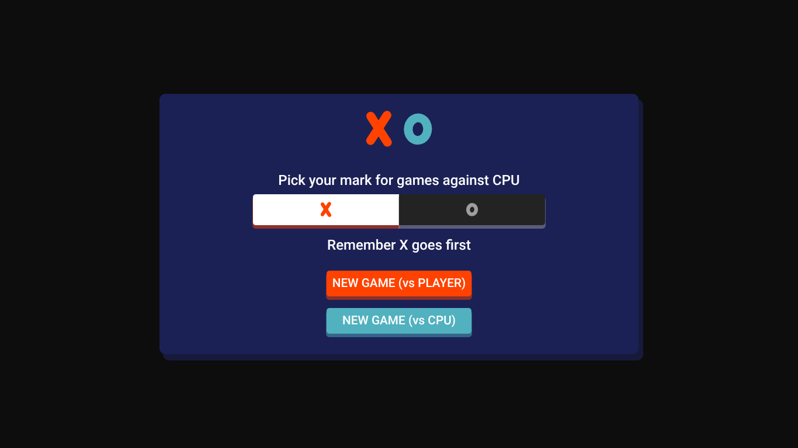
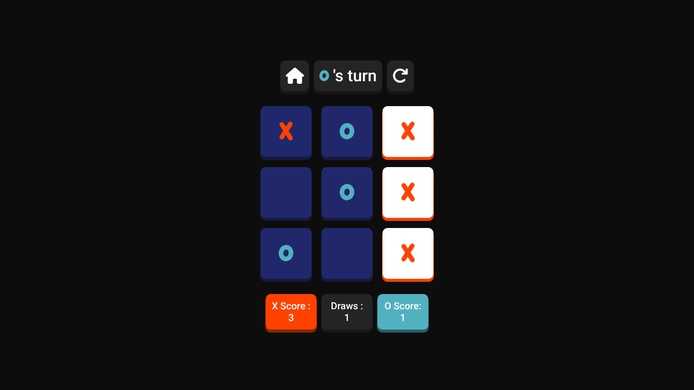
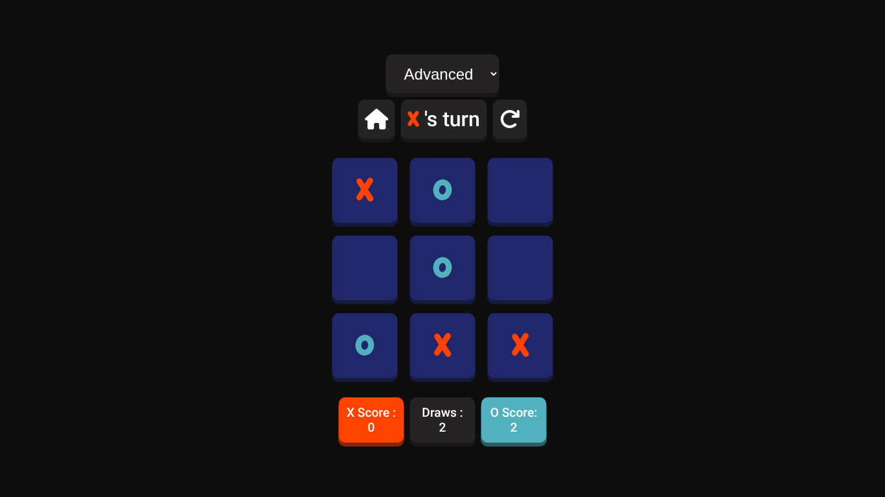

# 🎮️ Tic Tac Toe (JavaScript)

A simple and modern **Tic Tac Toe game built with HTML, CSS, and JavaScript** featuring a clean dark theme, score tracking, and both **single-player and two-player modes**.

Play it directly in your browser.

---

## ▶️ Play the Game

👉 [Play Tic Tac Toe](https://sameerbhagtani.itch.io/tic-tac-toe)

---

## ✨ Features

- 🎨 Clean **dark themed UI**
- 👥 **Two Player Mode** (local play)
- 🤖 **Single Player Mode vs CPU**
- 🧠 **3 Difficulty Levels**
- 🏆 **Score tracking (X, O, and Draws)**

---

## 🧠 AI Difficulty

The CPU behavior changes based on the selected difficulty:

- **Beginner**
    - CPU chooses moves **randomly**

- **Intermediate**
    - Uses the **Minimax algorithm**
    - Search depth limited to **2 levels**

- **Advanced**
    - Uses **full Minimax search**
    - Plays **perfectly (impossible to beat)**

---

## 📸 Screenshots

---

## 🛠️ Tech Stack

- HTML
- CSS
- JavaScript
